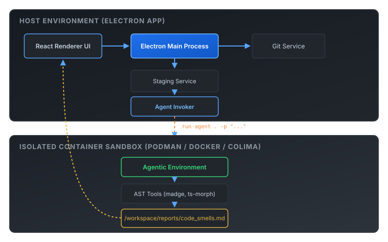
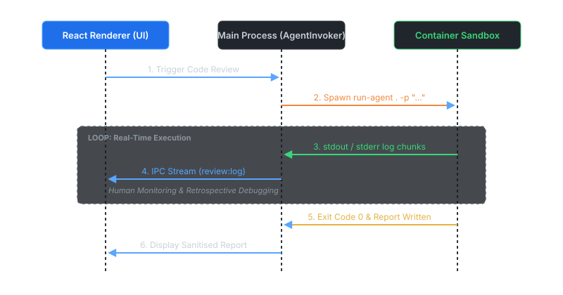

# agentic-code-review

A desktop application (Electron + React + TypeScript) built to automate single-repository and pull request diff code reviews using agentic AI models executing inside isolated container sandboxes.

---

## Background & Motivation

This project builds on top of **[agentflow](https://github.com/kfyh/agentflow)**, a multi-vendor agentic container runner designed to fit a personal workflow and comfort level with using LLM agents.

One primary use case for `agentflow` is conducting thorough code reviews. Before this app, preparing a code review required manual steps: checking out target repositories or branches on the host, setting up isolated staging directories, stripping unsafe metadata, selecting prompt templates, and invoking `run-agent`.

`agentic-code-review` automates this entire orchestration pipeline, making manual agentic code review workflows **consistent, repeatable, and easy to execute**.

---

## Objectives

The application provides two main review capabilities:

1. **Single Codebase Deep Review**:
   - Conducts a deep structural pass of a codebase to identify hidden technical debt.
   - Measures cyclomatic complexity hotspots (> 15) using AST parsing (`ts-morph`).
   - Detects intra-package circular dependency loops using established AST tools (`madge`, `dpdm`, `dependency-cruiser`).
   - Scans for SOLID principle violations and clean architecture code smells (layer leakage, feature envy, temporal coupling, primitive obsession).

2. **PR / Diff Review (Branch vs Main)**:
   - Evaluates pull requests and branch diffs against a base branch (e.g. `main`).
   - Detects hard-to-spot issues such as code overreach, backwards compatibility breaks (broken API contracts), unintended behaviour changes, and violations of modular coding standards.

---

## Key Highlights & Architecture

### 1. `agentflow` Integration (Phase 1 Subprocess → Phase 2 Dev Dependency)



<details>
<summary>View ASCII / Text Diagram</summary>

```
┌─────────────────────────────────────────────────────────────────────────────────┐
│                          HOST ENVIRONMENT (ELECTRON APP)                        │
│                                                                                 │
│   ┌───────────────────┐        ┌─────────────────────┐        ┌──────────────┐  │
│   │ React Renderer UI ├───────►│ Electron Main Proc. ├───────►│ Git Service  │  │
│   └─────────▲─────────┘        └──────────┬──────────┘        └──────────────┘  │
│             │                             │                                     │
│             │                             ▼                                     │
│             │                  ┌─────────────────────┐                          │
│             │                  │ Staging Service     │                          │
│             │                  │ (excl .git, CLAUDE) │                          │
│             │                  └──────────┬──────────┘                          │
│             │                             │                                     │
│             │                             ▼                                     │
│             │                  ┌─────────────────────┐                          │
│             │                  │ Agent Invoker (sub) │                          │
│             │                  └──────────┬──────────┘                          │
└─────────────┼─────────────────────────────┼─────────────────────────────────────┘
              │                             │ shell execution: run-agent . -p "..."
              │                             ▼
┌─────────────┼───────────────────────────────────────────────────────────────────┐
│             │             ISOLATED CONTAINER SANDBOX (PODMAN / DOCKER / COLIMA) │
│             │                                                                   │
│             │                  ┌─────────────────────┐                          │
│             │                  │ Agentic Environment │                          │
│             │                  └──────────┬──────────┘                          │
│             │                             │                                     │
│             │                             ▼                                     │
│             │                  ┌─────────────────────┐                          │
│             │                  │ AST Analysis Tools  │                          │
│             │                  │ (madge, ts-morph)   │                          │
│             │                  └──────────┬──────────┘                          │
│             │                             │                                     │
│             │                             ▼                                     │
│             │                  ┌─────────────────────┐                          │
│             └──────────────────┤ /workspace/reports/ │                          │
│                                │  code_smells.md     │                          │
│                                └─────────────────────┘                          │
└─────────────────────────────────────────────────────────────────────────────────┘
```

</details>

- **Phase 1 (Current)**: The desktop app serves as an orchestration layer. It handles host-side Git operations and workspace staging, then shells out as a subprocess to `agentflow`'s `run-agent` terminal command within a staged directory (`~/.agentic-code-review/staged/`).
- **Phase 2 (Upcoming Roadmap)**: There is an active desire to **turn `agentflow` into a dev dependency** (or shared library package). Transitioning from CLI subprocess invocation to a direct TypeScript library API will eliminate the requirement for a separate local `agentflow` checkout, enable typed container orchestration, and support dynamic AI provider detection.

---

### 2. Sandbox & Container Engine Flexibility

The app is container-runtime agnostic:

- Supports **Podman** on Linux.
- Supports **Colima** or Docker Desktop on macOS.
- Supports native **Docker Engine** on Linux / WSL2 on Windows.

All execution occurs inside non-root container sandboxes with dropped privileges (`--cap-drop ALL`, `--security-opt no-new-privileges`).

---

### 3. Real-Time Stream Monitoring & Debugging



<details>
<summary>View ASCII / Text Sequence Diagram</summary>

```
┌──────────────────────┐           ┌──────────────────────┐          ┌──────────────────────┐
│ React Renderer (UI)  │           │ Electron Main Proc.  │          │ Container Sandbox    │
└──────────┬───────────┘           └──────────┬───────────┘          └──────────┬───────────┘
           │                                  │                                 │
           │  1. Trigger Code Review          │                                 │
           ├─────────────────────────────────►│                                 │
           │                                  │  2. Spawn run-agent . -p "..."  │
           │                                  ├────────────────────────────────►│
           │                                  │                                 │
           │                                  │  ◄── Real-Time Execution Loop ──┤
           │  3. IPC Stream (review:log)      │  4. stdout / stderr log chunks │
           │◄─────────────────────────────────┤                                 │
           │                                  │                                 │
           │  [ Human Monitoring & Retrospective Debugging Log Output ]         │
           │                                  │                                 │
           │                                  │  5. Exit Code 0 & Report File   │
           │                                  │◄────────────────────────────────┤
           │  6. Render Sanitised Report      │                                 │
           │◄─────────────────────────────────┤                                 │
```

</details>

- Streams container `stdout` and `stderr` live to an interactive log console UI.
- Enables **human monitoring** of the agent's actions in real-time during execution.
- Preserves full log records for **retrospective debugging** if analysis encounters errors or partial passes.

---

### 4. Customisable Prompt Architecture

- Built on a comprehensive code review prompt template ([`src/prompts/code-review-prompt.md`](file:///workspace/src/prompts/code-review-prompt.md)).
- Mandates AST-based tool execution (`madge`, `dpdm`, `dependency-cruiser`, `ts-morph`) rather than relying on LLM token prediction alone.
- **Prompt Customisation Note**: While the code review prompt template can currently be modified on disk via [`src/prompts/code-review-prompt.md`](file:///workspace/src/prompts/code-review-prompt.md), **there are future plans to allow users to edit, customise, and manage prompts directly within the application**.

---

## Threat Model & Security Realities

> [!NOTE]
> **Network Access**: The agent operates with full outbound network access via the container host to install required analysis packages (`madge`, `ts-morph`) or fetch public dependencies.

The threat model focuses primarily on **host integrity and source safety** rather than data exfiltration:

| Threat Vector                   | Mitigation Strategy                                                                                                                     |
| :------------------------------ | :-------------------------------------------------------------------------------------------------------------------------------------- |
| **Host System Tampering**       | Agent runs inside non-root container with dropped capabilities (`--cap-drop ALL`, `--security-opt no-new-privileges`).                  |
| **Codebase Corruption**         | Workspace is mounted in an isolated staging copy (`~/.agentic-code-review/staged/<commitSha>`); host repo remains untouched.            |
| **Unauthorised Git Commits**    | `git` binary is intentionally omitted from the container image, preventing unauthorised local or remote commits.                        |
| **Git History Leakage**         | `.git/` directory is explicitly excluded during staging prep before mounting into the sandbox.                                          |
| **File-Based Prompt Injection** | `CLAUDE.md` is stripped from the staged workspace to prevent instruction overriding; baseline constraints enforced by `guidelines.txt`. |
| **Credential Safety**           | OAuth tokens reside in named container volumes (`agentic-coder-claude`), keeping credentials out of `process.env`.                      |
| **Renderer XSS**                | UI runs with `contextIsolation: true`, `nodeIntegration: false`, and renders Markdown via `marked` + `DOMPurify`.                       |

---

## Prerequisites

- **`run-agent` Command / Alias**: `run-agent` must resolve in your **login shell's interactive startup file** — `~/.zshrc` on macOS, `~/.bashrc` on most Linux distributions. It is invoked via `<shell> -i -c`, so a shell alias is supported (and is the intended way to select your provider); a real executable on `PATH` works too.

  The shell is resolved from your passwd record (`os.userInfo().shell`), falling back to `$SHELL` and then a platform default. Set `AGENT_SHELL` to override — useful if your aliases live in a shell other than your login shell.

  Aliases may chain, and arguments are appended, so a provider-selecting chain resolves correctly:

  ```bash
  # ~/.zshrc
  alias run-ai-agent='/path/to/agentflow/run-agent.sh'
  alias run-claude-agent='run-ai-agent -c claude'
  alias run-agent='run-claude-agent'
  ```
- For container runtime setup, engine image builds (Claude, Gemini, Mistral), and credential authentication, see **[agentflow](https://github.com/kfyh/agentflow)**.

---

## Quick Start & Build Instructions

### 1. Development Mode

`npm run dev` builds the main and preload bundles once, then starts the Vite dev server on port 3000 with hot reloading for the renderer. It does **not** launch Electron:

```bash
# Install dependencies
npm install

# Build main/preload bundles and start the Vite dev server
npm run dev
```

Opening `http://localhost:3000` in a browser renders the UI, but anything behind IPC — repository browsing, agent invocation — is unavailable, since `window.electronAPI` only exists inside Electron. Use `npm run start` to exercise those paths.

### 2. Build & Run Locally

To compile TypeScript bundles and launch the local Electron application:

```bash
# Build main, preload, and renderer bundles
npm run build

# Run local Electron app
npx electron .
# or
npm run start
```

> **macOS note**: the prebuilt Electron binary is only linker-signed, so Gatekeeper blocks it as revoked and offers "Move to Trash" — which deletes it from `node_modules`. The `postinstall` hook ad-hoc signs the bundle to prevent this. If `npm run start` is still blocked, re-run it manually:
>
> ```bash
> codesign --force --deep --sign - node_modules/electron/dist/Electron.app
> ```

### 3. Packaging Standalone Desktop Executable

To generate a standalone desktop executable. Note that the `build` configuration in `package.json` currently declares **Linux targets only** (`AppImage` and `dir`); producing a `.dmg` or `.exe` requires adding the corresponding `mac` or `win` target first:

```bash
# Build desktop executable (outputs to release/ directory)
npm run dist

# Or create unpacked executable directory
npm run pack
```

---

## Available NPM Scripts

- `npm run dev`: Build main and preload bundles, then serve the renderer via Vite on port 3000. Does not launch Electron.
- `npm run start`: Build main, preload, and renderer assets and start Electron process.
- `npm run build`: Build production bundles for main, preload, and renderer processes.
- `npm run pack`: Create unpacked desktop executable directory under `release/`.
- `npm run dist`: Package standalone executable distributions under `release/` (Linux targets only, as configured).
- `postinstall`: Ad-hoc signs the prebuilt Electron binary on macOS so Gatekeeper permits it. No-op on other platforms.
- `npm run test`: Execute Jest unit test suite.
- `npm run typecheck`: Perform TypeScript type checking (`tsc --noEmit`).
- `npm run lint`: Run ESLint across the codebase.
- `npm run format`: Format codebase with Prettier.

---

## Project Structure

```
agentic-code-review/
├── docs/                        # Diagram assets (SVG)
│   ├── architecture.svg
│   └── sequence.svg
├── src/
│   ├── main/                    # Electron main process
│   │   ├── config.ts            # Workspace & staging path configuration
│   │   ├── ipc.ts               # Inter-process communication handlers
│   │   └── services/
│   │       ├── agentInvoker.ts  # Subprocess wrapper spawning run-agent
│   │       ├── gitService.ts    # Host-side git clone, fetch, and diff ops
│   │       ├── stagingService.ts# Workspace staging and exclusion filtering
│   │       ├── historyService.ts# Persistent review execution history
│   │       ├── installService.ts# Dependency & tool verification
│   │       └── reportService.ts # Markdown report parsing & stdout fallback
│   ├── preload/                 # Electron preload scripts (contextBridge)
│   ├── renderer/                # React UI renderer process
│   └── shared/                  # Shared types and IPC channel definitions
├── specs/                       # Architecture specs & prompt design docs
│   ├── app-spec.md
│   ├── prompt_mvp.md
│   └── prompt_mvp_review.md
├── code-review-prompt.md        # Code review prompt template
├── readme_corrections.md        # Documentation audit & corrections log
├── package.json
└── tsconfig.json
```

---

## License

ISC License.
